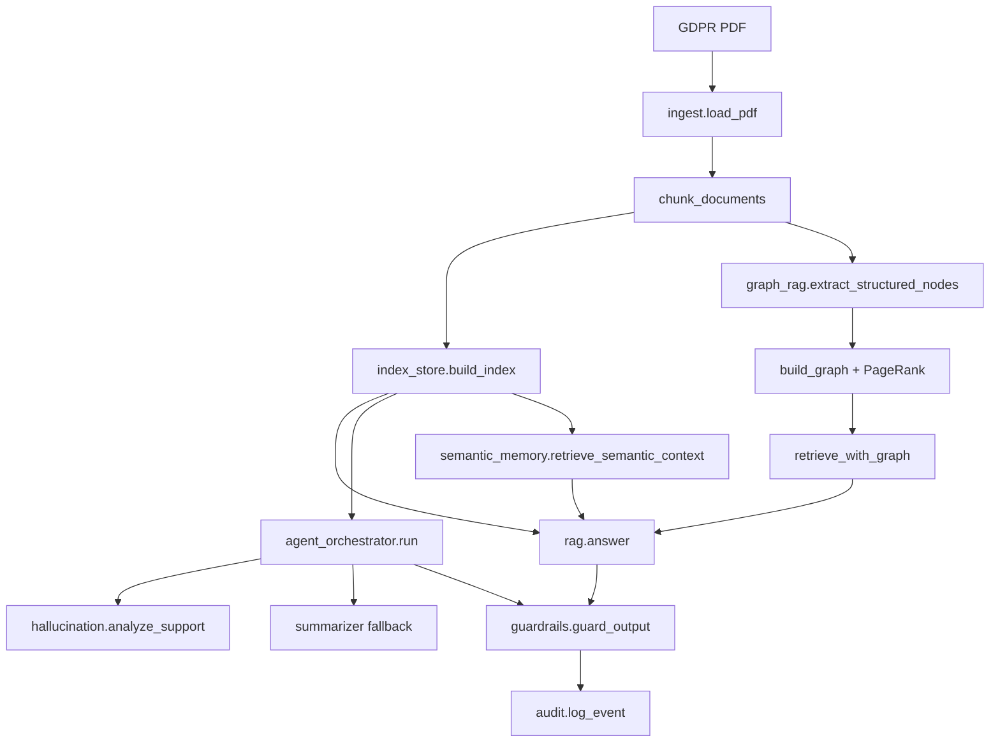

"""Architecture Diagram"""

Baseline: ingest -> index -> retrieve -> answer -> guardrails -> audit.
Graph: adds structural extraction + neighbor expansion.
Agent: orchestrator adds support analysis, regeneration, summarization.
Memory: semantic recall augments question context.
Safety: guardrails + hallucination mitigation.